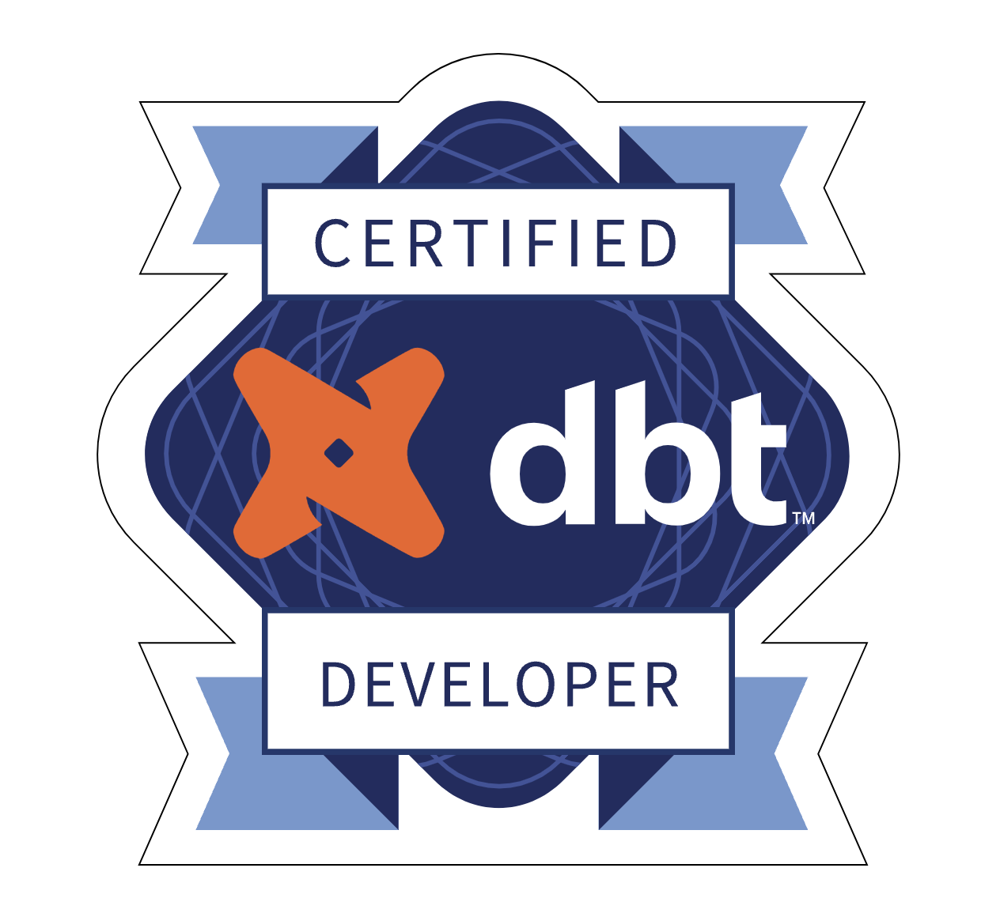

# dbt Certificate Training

The goal of this repo is to store practice code and training resources used in preparation for the dbt Analytics Engineering Certification exam.

## Resources

- [dbt Analytics Engineering Certification Exam](https://www.getdbt.com/blog/dbt-certification-program/)

- [Preparing for the dbt 'Analytics Engineering' Certification](https://medium.com/geekculture/preparing-for-the-dbt-analytics-engineering-certification-5496c3ec6e15)

- [dbt Analytics Engineering Certification Exam Study Guide](https://www.getdbt.com/assets/uploads/dbt_certificate_study_guide.pdf)

- [How Fivetran + dbt actually fail](https://medium.com/@laurengreerbalik/how-fivetran-dbt-actually-fail-3a20083b2506) ([related reddit thread](https://www.reddit.com/r/dataengineering/comments/xxfmat/how_fivetran_dbt_actually_fail/))

## Studying Docs

- [Progress Sync](https://docs.google.com/document/d/1MPwNXuyeBqjwfcUeMVRx-AbRIW8X4Bt0kKq2pHtCIiY/edit?usp=sharing)
- [Will's Notes](https://docs.google.com/document/d/18gH7w68tCgesLYHfDyxC1U3xiQli7bLy_dmp5-M18uw/edit?usp=sharing)

## To-Do

- [ ] Figure out production deployment
- [x] Manage branches
- [ ] Join dbt slack

## dbt Milestones

- [x] Create a useful macro with Jinja
- [x] Implement source freshness
- [x] Create a custom singular test for a model
- [x] Import/Create a custom generic test for a model
- [x] Import additional tests/packages into project
- [x] Use codegen, dbt_utils, dbt_expectations packages
- [ ] Create a dbt exposure
- [x] Create a dbt analysis
- [x] Create a dbt snapshot
- [ ] Create a python model
- [x] Use Jinja templating language in creating DRY code for a model
- [ ] Understand all of the config options for resource properties
- [x] Write a detailed .yml description for a model/source, using all available documentation features
- [ ] Have a complete prod deployment
- [x] Have test coverage as CICD requirements with `dbt_meta_testing` package

## dbt Course Completion

- [x] dbt Fundamentals
- [x] Jinja, Macros, and Packages
- [x] Advanced Materializations
- [x] Analyses and Seeds
- [x] Refactoring SQL for Modularity
- [x] Advanced Testing
